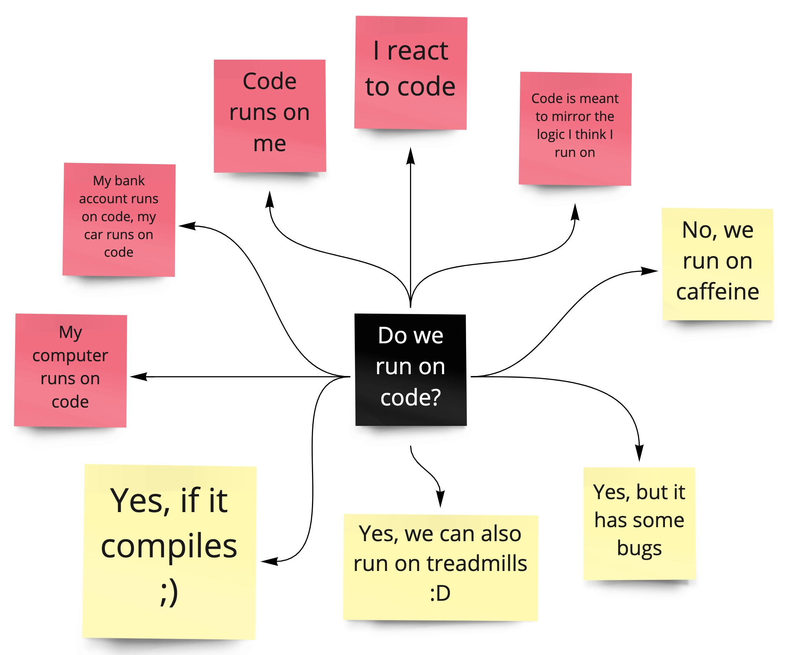

# Do we run on code? 

How past experiences influence our design choices, and overcoming the unknown.

---

<!-- ---

### Disclaimer
This is not a talk about thinking outside the box. We already do that. It is just about *us* as humans.. or code -->

---
## Agenda

* `$PATH - environment variables`
    * Perspective from a computer
    * We run on hardware and software
    * Change is Nature
* `src/index.js`
    * Past Experiences
    * Overcoming The Unknown
    * Design Choices

---
## What It's Like To be a Computer: An Interview with GPT-3
https://www.youtube.com/watch?v=PqbB07n_uQ4&t=1s

* This AI is suprisingly indistinguishable from a human. It learned from us. 
* Perhaps, like it, we run on code after all, especially if we can create something so similar.

---
## We run on hardware and software

* *Hardware* is the `random.seed()` that makes us different. 
  *Software* is what we do with it.. IT ;)
* `git push` Sure, there are somes things we can hardly change.
    * DNA -- Nuture vs Nature?
    * We are driven by feelings
    * `.bash_history` -- past experiences

---
# Past Experiences

* It's okay, no matter what. This is what makes us unique.

--- 
## Change is Nature

Variety helps us survive. Such is natural selection which protects us from the future and the unknown.

---
# The Unknown

* Here we may tend to make assumptions. Even this statement is an assumption xD
* We can never know for sure, but we can try.
* Different perspectives in the team remove the bias of past experience, and make for a strong "assumption" -- How to solve a new/unforseen problem.
* Of course, research helps too.
* ??
* We can never know everything..

---
# Design Choices

$x*Past\ Experiences\ +\ (1-x)*Unknowns\ =\ Assumptions$

<!-- $Planning \propto Time$ -->

### "This equation will change how you see the world (the logistic map)"
https://www.youtube.com/watch?v=ovJcsL7vyrk